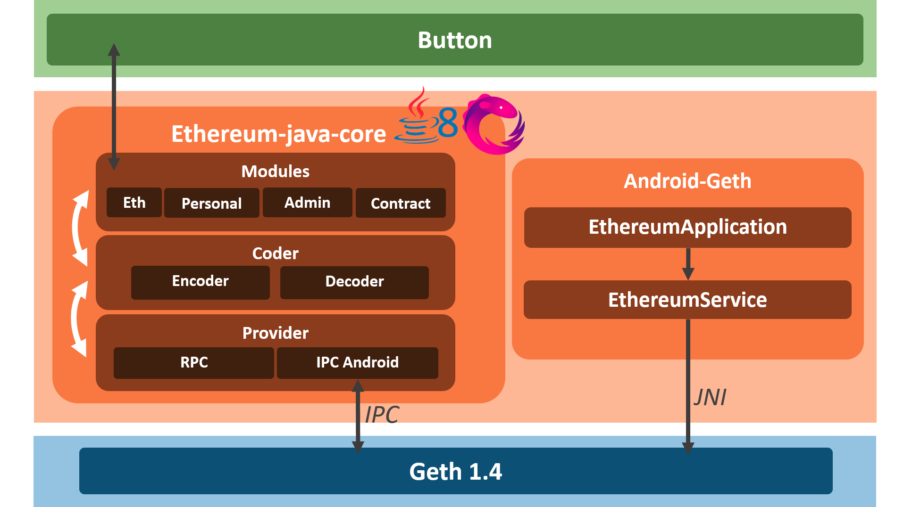

# Ethdroid : Easy-to-use Ethereum client wrapper for Android 

## Why using Ethdroid

If you think that smartphone is future of blockchain, **Ethdroid** is here to help you building amazing decentralized smartphone apps. 

This project was born as soon as the Geth community built the first android archive. Our needs was 
to allow an Android App communicate with an inproc Geth node.

Thanks to our hard work, we've reached our goals and built 3 differents use-cases of decentralized smartphone apps : 
* decentralized car sharing
* voting through blockchain
* location of peoples all arround the world

[Contact us](mailto:ethereummobile@gmail.com) for more informations on our works.

With Ethereum-android it becomes easier to :
* instanciate an Ethereum go-ethereum inproc node, 
* manage accounts, 
* get nodes information, 
* send Ether 
* and also call smart-contracts. 

Futhermore **Rx-java 1** and its extensions simplify control of asynchronous flows and background processes.

This package can be used on **Android 21+** and with **Geth 1.6+**.

## Installation

1. Create an Android project

2. In you build.gradle, add these dependencies :
    //TODO

    For a snapshot version, you must add this repository :
     ```
         repositories {
           maven { url 'https://jitpack.io' }
         }
    ```

## Getting Started
### Start an inproc node

Create your Application subclass of EthereumApplication

:warning: don't forget to declare the Application in *AndroidManifest.xml*
```java
import com.sqli.blockchain.android_geth.EthereumApplication;

public class MyApplication extends EthereumApplication{
    [...]
}
```

In each activity you can be notified when Geth service is available, registering to the event in onCreate method.

When onEthereumServiceReady is called, you can do everything you want, like update UI, or create instanciate EthereumJava (see next section).
```java
import com.sqli.blockchain.android_geth.EthereumService;

public class MainActivity implements EthereumService.EthereumServiceInterface{

    @Override
    protected void onCreate(Bundle savedInstanceState) {
        [...]
        MyApplication application = (MyApplication) getApplication();
        application.registerGethReady(this);
    }

    @Override
    public void onEthereumServiceReady() {
        //Update UI to start comunication
        super.onEthereumServiceReady();
    }
}
```

### Communicate with a node

In your Application class :
```java
[...]
public EthereumJava ethereumjava;
[...]

public EthereumJava getEthereumJava() {
    return ethereumjava;
}

@Override
public void onEthereumServiceReady() {
    ethereumjava = new EthereumJava.Builder()
            .provider(new AndroidIpcProvider(ethereumService.getIpcFilePath()))
            .build();

    super.onEthereumServiceReady();
}  
```

### Accounts management

```java
String password = "passwd";
String accountId = ethereumJava.personal.createAccount(password);
boolean unlocked = ethereumJava.personal.unlockAccount(accountId);
```

### Call a node module
**Example :** get node information asynchronously 
```java
EthereumJava ethereumJava = ((MyApplication) getApplication()).getEthereumJava()
Observable<NodeInfo> observable = ethereumJava.admin.getNodeInfo()
observable.subscribe(nodeInfo -> System.out.println(nodeInfo));

```


### Send 1 Ether

```java
String from = "0xaaaa...";
String to = "0xbbbb...";

TransactionRequest tr = new TransactionRequest("","");
tr.setValueHex(SolidityUtils.toWei(BigInteger.ONE.toString(),"ether").toBigInteger());        
Hash transactionHash = ethereumJava.eth.sendTransaction(tr);

```


### Instanciate a *smart-contract* 

1. From the following Solidity smart-contract source code:
    ```javascript
    contract ContractExample {

        event e(bool);
        event multipleEvent(bool,bool,bool);

        void foo(){
            [...]
        }

        uint bar(int a){
            [...]
        }
        
        event eventOutputMatrix(int[3][3]){
            [...]
        }
        
        function functionOutputMatrix() returns(uint8[2][8]){
            [...]
        }
        
        function functionInputMatrix(uint8[3]){
            [...]
        }
        
        function functionOutputMultiple() returns(bool,uint8[2][3]){
            [...]
        }
    }    
    ```

2. Create the related Java interface :
    ```java
    interface ContractExample extends ContractType{
       
       SolidityEvent<SBool> e();
       
       SolidityEvent3<SBool,SBool,SBool> multipleEvent();
          
       SolidityFunction foo();
       
       SolidityFunction bar(SInt.SInt256 a);
     
  
       @SolidityElement.ReturnParameters({@SArray.Size({3,3})}) 
       SolidityEvent<SArray<SArray<SInt.SInt256>>> eventOutputMatrix();
       
       @SolidityElement.ReturnParameters({@SArray.Size({2,8})})
       SolidityFunction<SArray<SArray<SUInt.SUInt8>>> functionOutputMatrix();
      
       SolidityFunction functionInputMatrix(@SArray.Size({3}) SArray<SUInt.SUInt8> a);
       
       @SolidityElement.ReturnParameters({@SArray.Size(),@SArray.Size({2,3})})
       SolidityFunction2<SBool,SArray<SArray<SUInt.SUInt8>>> functionOutputMultiple();
       
    }
    ```
    
    When an input/output parameter of a function/event is an array, you have to specify its size with 
    the annotation : **@SArray.Size**. 
    
    Its parameter is an array of integers like **@SArray.Size{2,3,4}** (its equivalent to an array
    of a size *type*[2][3][4])
    
    When your function/event returns an array, to specify its length you have to use the annotation 
    **@SolidityElement.ReturnParameters({})** which takes an array of @SArray.Size annotations as value.
    
    When your function returns multiple types, you have to specify the related SolidityFunction.
    For exemple, if your function returns 2 booleans you must use return **SolidityFunction2<SBool,SBool>**
    
    Table of multiple return type elements and their related wrapper :
    
    |Number of Returns  |Function                       |Event                      |Output                     |
    |--:                |---                            |---                        |---                        |
    |0                  |SolidityFunction               |SolidityEvent              |SType                      |
    |1                  |SolidityFunction`<T>`          |SolidityEvent`<T>`         |SingleReturn`<T>`          |
    |2                  |SolidityFunction2`<T1,T2>`     |SolidityEvent2`<T1,T2>`    |PairReturn`<T1,T2>`        |
    |3                  |SolidityFunction3`<T1,T2,T3>`  |SolidityEvent3`<T1,T2,T3>` |TripleReturn`<T1,T2,T3>`   |
    
3. Instanciate the *smart-contract* available on the blockchain at the given address

    ```java
    
       ContractExample contract = ethereumJava.contract.withAbi(ContractExample.class).at("0xcccc...");
    
    ```
        
### Interact with deployed *smart-contract*

[**Official doc of smart-contract interaction**](https://github.com/ethereum/go-ethereum/wiki/Contracts-and-Transactions#interacting-with-contracts)

#### Make a local then reverted call to a *smart-contract* function 

```java

    PairReturn<SBool,SArray<SArray<SUInt.SUInt8>>> result = contract.functionOutputMultiple().call();
    
    SBool resultSBool = result.getElement1();
    
    SArray<SArray<SUInt.SUInt8>> resultMatrix = result.getElement2();

```

#### Make a persistent call to a *smart-contract* function and be notified when it's mined

```java
    String from = "0xaaaa..."; /* put here the account which call the function */
    
    contract.foo().sendTransactionAndGetMined(from,new BigInteger("90000"))
        .observeOn(AndroidSchedulers.mainThread())
        .subscribe(minedTransaction -> doWhenMined()); 
    
    /*
        doWhenMined is a local method called when transaction has been mined.
        You can refresh the view directly in this method
    */
```

### Listen to *smart-contract* events

From Android app, subscribe to Solidity events in a background process and be notified in main thread to update the view.

```java
    contract.e.watch()
        .observeOn(AndroidSchedulers.mainThread())
        .subscribe(booleanAnswer -> doWhenEventTriggered());
    
    /*
        doWhenEvent is a local method called when event is triggered by the deployed smart-contract
        booleanAnswer is the parameter returned by the triggered event. 
        You can directly update your app view
    */
```

## Project Architecture 


## Contribute
//TODO
## Licence

```
The MIT License (MIT)
```
See [Licence](LICENSE).

